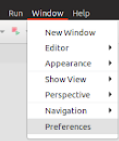
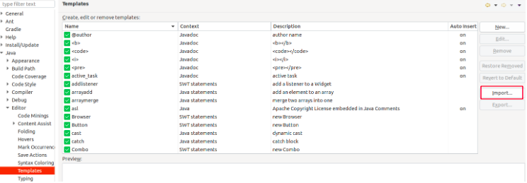

# TJF Templates

Visando o desenvolvimento *backend* de aplicações que utilizem como framework o TJF, foram criados *templates* que facilitam a construção de códigos.

> Atualmente os templates foram construídos para IDE *Eclipse*.

## Templates Existentes

Todos os templates recriam a assinatura da sua classe, dessa forma antes de utiliza-los apague a assinatura da sua classe.  

### tjfexchange

Descrição: Este template cria uma *interface* de **Exchange** conforme [documentação](https://tjf.totvs.com.br/wiki/tjf-messaging-stream). 

### tjfpublisher

Descrição: Este template cria uma *classe* de **Publicação** de mensagens conforme [documentação](https://tjf.totvs.com.br/wiki/tjf-messaging-stream).

### tjfsubscriber

Descrição: Este template cria uma *classe* de **Consumo** de mensagens conforme [documentação](https://tjf.totvs.com.br/wiki/tjf-messaging-stream).

### tjfrepository

Descrição: Este template cria uma *classe* que implementa a abstração da classe **CrudAggregateRepository** conforme [documentação](https://tjf.totvs.com.br/wiki/tjf-repository-aggregate).

### tjfcontroller

Descrição: Este template cria uma *classe* de controller, contendo a implementação da versão do [Guia de implementacao das APIs TOTVS](http://tdn.totvs.com/pages/viewpage.action?pageId=484701395), assim como um método **GET** e um método **POST**.

### tjfcontrollerswagger

Descrição: Este template cria uma *classe* de controller, contendo a implementação da versão do [Guia de implementacao das APIs TOTVS](http://tdn.totvs.com/pages/viewpage.action?pageId=484701395), assim como um método **GET** e um método **POST**, contendo anotações para o [Swagger](https://swagger.io/docs/).

## Como Utilizar  

Para começar utilizar os templates no Eclipse, baixe o arquivo *.xml* do [repositório](https://github.com/totvs/tjf-templates).

### No eclipse:

- Window -> Preferences;

- Java -> Editor -> Templates;
- Import...
- Selecione o arquivo *.xml* que você baixou.

Dessa forma no seu editor basta digitar o nome no template e apertar CTRL + Espaço.

## Posso colaborar?
Com certeza! Se sentiu falta de algo que possa ser criado um template, faça um *pull request* que iremos avaliar e disponibilizar para todos. 